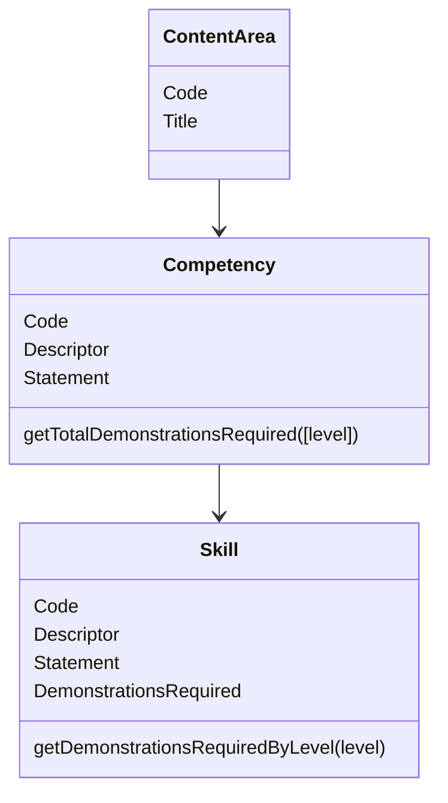

# Content Areas

```mermaid
classDiagram

ContentArea --> Competency
Competency --> Skill

ContentArea : Code
ContentArea : Title

Competency : Code
Competency : Descriptor
Competency : Statement
Competency : getTotalDemonstrationsRequired([level])

Skill : Code
Skill : Descriptor
Skill : Statement
Skill : DemonstrationsRequired
Skill : getDemonstrationsRequiredByLevel(level)
```